# 架构设计 (Architecture Design)

## 🎯 架构概览

多智能体协作协议采用分层微服务架构，支持分布式部署、水平扩展和高可用性。架构设计遵循解耦、可扩展、可观测的原则，为大规模多智能体系统提供坚实的技术基础。

## 🏗️ 总体架构

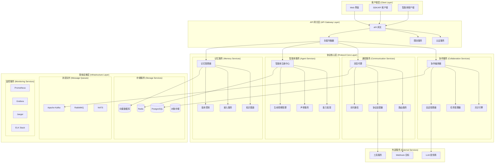
```mermaid
graph TB
    subgraph "客户端层 (Client Layer)"
        WEB[Web 界面]
        SDK[SDK/API 客户端]
        AGENT_CLIENT[智能体客户端]
    end

    subgraph "API 网关层 (API Gateway Layer)"
        GATEWAY[API 网关]
        AUTH[认证服务]
        RATE_LIMIT[限流服务]
        LOAD_BALANCER[负载均衡器]
    end

    subgraph "协议核心层 (Protocol Core Layer)"
        subgraph "协作服务 (Collaboration Services)"
            COLLAB_ORCHESTRATOR[协作编排器]
            CONSENSUS_ENGINE[共识引擎]
            TASK_MANAGER[任务管理器]
            SESSION_MANAGER[会话管理器]
        end

        subgraph "通信服务 (Communication Services)"
            MESSAGE_BROKER[消息代理]
            ROUTING_SERVICE[路由服务]
            PROTOCOL_ADAPTER[协议适配器]
            REAL_TIME_COMM[实时通信]
        end

        subgraph "智能体服务 (Agent Services)"
            AGENT_REGISTRY[智能体注册中心]
            CAPABILITY_DISCOVERY[能力发现]
            REPUTATION_SERVICE[声誉服务]
            LIFECYCLE_MANAGER[生命周期管理]
        end

        subgraph "记忆服务 (Memory Services)"
            MEMORY_MANAGER[记忆管理器]
            KNOWLEDGE_GRAPH[知识图谱]
            EMBEDDING_SERVICE[嵌入服务]
            VERSION_CONTROL[版本控制]
        end
    end

    subgraph "基础设施层 (Infrastructure Layer)"
        subgraph "存储服务 (Storage Services)"
            POSTGRES[(PostgreSQL)]
            REDIS[(Redis)]
            VECTOR_DB[(向量数据库)]
            OBJECT_STORE[(对象存储)]
        end

        subgraph "消息队列 (Message Queues)"
            KAFKA[Apache Kafka]
            RABBITMQ[RabbitMQ]
            NATS[NATS]
        end

        subgraph "监控服务 (Monitoring Services)"
            PROMETHEUS[Prometheus]
            GRAFANA[Grafana]
            JAEGER[Jaeger]
            ELK[ELK Stack]
        end
    end

    subgraph "外部服务 (External Services)"
        LLM_PROVIDERS[LLM 提供商]
        TOOL_SERVICES[工具服务]
        WEBHOOK_TARGETS[Webhook 目标]
    end

    %% 连接关系
    WEB --> GATEWAY
    SDK --> GATEWAY
    AGENT_CLIENT --> GATEWAY

    GATEWAY --> AUTH
    GATEWAY --> RATE_LIMIT
    GATEWAY --> LOAD_BALANCER

    LOAD_BALANCER --> COLLAB_ORCHESTRATOR
    LOAD_BALANCER --> MESSAGE_BROKER
    LOAD_BALANCER --> AGENT_REGISTRY
    LOAD_BALANCER --> MEMORY_MANAGER

    COLLAB_ORCHESTRATOR --> CONSENSUS_ENGINE
    COLLAB_ORCHESTRATOR --> TASK_MANAGER
    COLLAB_ORCHESTRATOR --> SESSION_MANAGER

    MESSAGE_BROKER --> ROUTING_SERVICE
    MESSAGE_BROKER --> PROTOCOL_ADAPTER
    MESSAGE_BROKER --> REAL_TIME_COMM

    AGENT_REGISTRY --> CAPABILITY_DISCOVERY
    AGENT_REGISTRY --> REPUTATION_SERVICE
    AGENT_REGISTRY --> LIFECYCLE_MANAGER

    MEMORY_MANAGER --> KNOWLEDGE_GRAPH
    MEMORY_MANAGER --> EMBEDDING_SERVICE
    MEMORY_MANAGER --> VERSION_CONTROL

    COLLAB_ORCHESTRATOR --> POSTGRES
    MESSAGE_BROKER --> KAFKA
    MEMORY_MANAGER --> VECTOR_DB
    AGENT_REGISTRY --> REDIS

    SESSION_MANAGER --> LLM_PROVIDERS
    PROTOCOL_ADAPTER --> TOOL_SERVICES
    ROUTING_SERVICE --> WEBHOOK_TARGETS
```

## 🔧 核心组件架构

### 1. 协作编排器 (Collaboration Orchestrator)

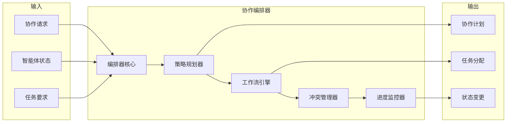
```mermaid
graph LR
    subgraph "协作编排器"
        CO[编排器核心]
        SP[策略规划器]
        WE[工作流引擎]
        CM[冲突管理器]
        PM[进度监控器]
    end

    subgraph "输入"
        CI[协作请求]
        AS[智能体状态]
        TR[任务要求]
    end

    subgraph "输出"
        CP[协作计划]
        TA[任务分配]
        SC[状态变更]
    end

    CI --> CO
    AS --> CO
    TR --> CO

    CO --> SP
    SP --> WE
    WE --> CM
    CM --> PM

    SP --> CP
    WE --> TA
    PM --> SC
```

协作编排器是多智能体协作的大脑，负责：

- **策略规划**: 根据任务特性和智能体能力制定协作策略
- **工作流管理**: 编排和执行复杂的多智能体工作流
- **冲突解决**: 检测和解决智能体间的冲突
- **进度跟踪**: 监控协作进度并动态调整策略

### 2. 消息代理架构 (Message Broker Architecture)

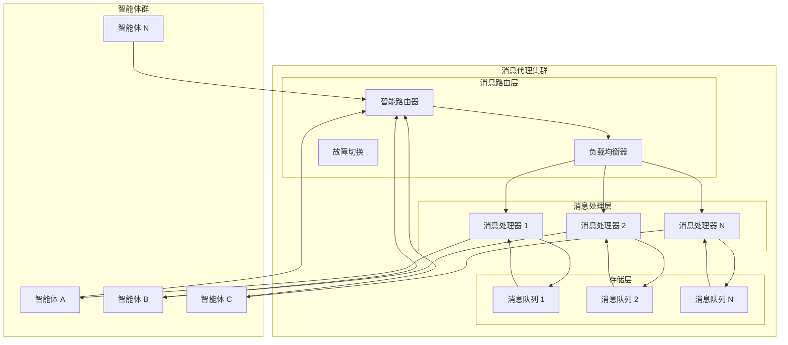
```mermaid
graph TB
    subgraph "消息代理集群"
        subgraph "消息路由层"
            ROUTER[智能路由器]
            LB[负载均衡器]
            FS[故障切换]
        end

        subgraph "消息处理层"
            MP1[消息处理器 1]
            MP2[消息处理器 2]
            MP3[消息处理器 N]
        end

        subgraph "存储层"
            MQ1[消息队列 1]
            MQ2[消息队列 2]
            MQ3[消息队列 N]
        end
    end

    subgraph "智能体群"
        A1[智能体 A]
        A2[智能体 B]
        A3[智能体 C]
        AN[智能体 N]
    end

    A1 --> ROUTER
    A2 --> ROUTER
    A3 --> ROUTER
    AN --> ROUTER

    ROUTER --> LB
    LB --> MP1
    LB --> MP2
    LB --> MP3

    MP1 --> MQ1
    MP2 --> MQ2
    MP3 --> MQ3

    MQ1 --> MP1
    MQ2 --> MP2
    MQ3 --> MP3

    MP1 --> A1
    MP2 --> A2
    MP3 --> A3
```

消息代理采用分布式架构，特点包括：

- **智能路由**: 基于消息类型、优先级和目标智能体的智能路由
- **负载均衡**: 动态负载均衡确保系统高可用性
- **容错机制**: 故障检测和自动恢复机制
- **消息持久化**: 关键消息的持久化存储和重试机制

### 3. 记忆系统架构 (Memory System Architecture)

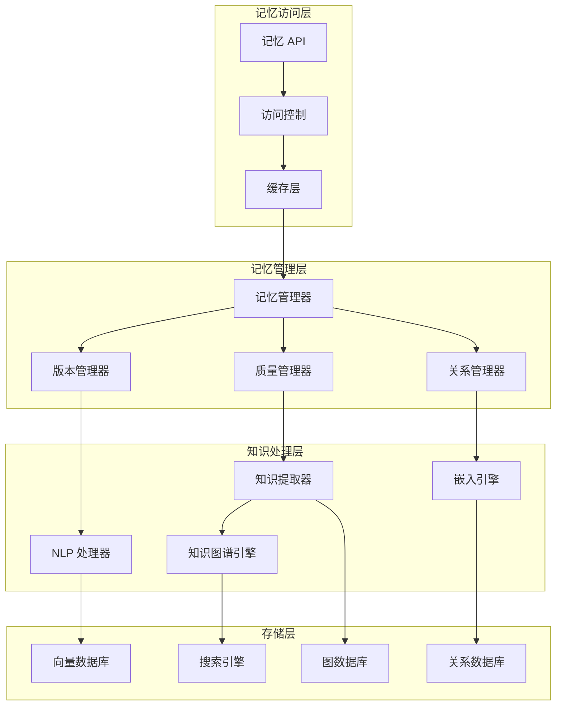
```mermaid
graph TB
    subgraph "记忆访问层"
        API[记忆 API]
        AC[访问控制]
        CACHE[缓存层]
    end

    subgraph "记忆管理层"
        MM[记忆管理器]
        VM[版本管理器]
        QM[质量管理器]
        RM[关系管理器]
    end

    subgraph "知识处理层"
        NLP[NLP 处理器]
        KE[知识提取器]
        EE[嵌入引擎]
        KG[知识图谱引擎]
    end

    subgraph "存储层"
        VECTOR[向量数据库]
        GRAPH[图数据库]
        RELATIONAL[关系数据库]
        SEARCH[搜索引擎]
    end

    API --> AC
    AC --> CACHE
    CACHE --> MM

    MM --> VM
    MM --> QM
    MM --> RM

    VM --> NLP
    QM --> KE
    RM --> EE
    KE --> KG

    NLP --> VECTOR
    KE --> GRAPH
    EE --> RELATIONAL
    KG --> SEARCH
```

记忆系统采用分层架构：

- **访问层**: 提供统一的记忆访问接口和权限控制
- **管理层**: 负责记忆的生命周期管理和质量控制
- **处理层**: 执行知识提取、嵌入和图谱构建
- **存储层**: 多模态存储支持不同类型的记忆数据

## 📊 数据流架构

### 1. 协作数据流

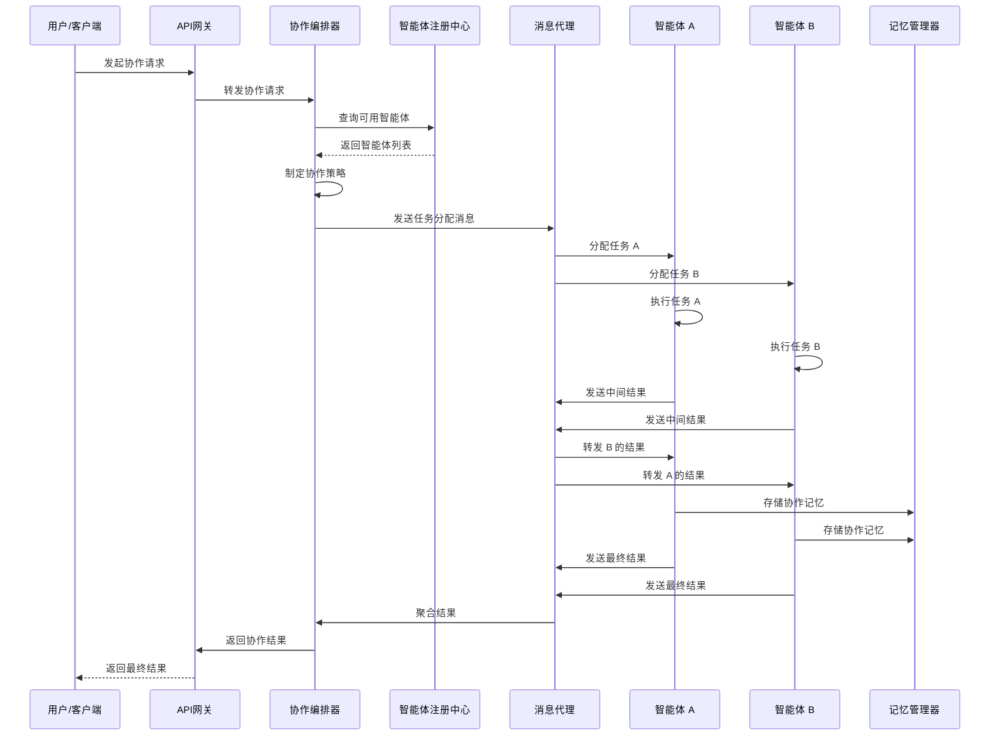
```mermaid
sequenceDiagram
    participant U as 用户/客户端
    participant G as API网关
    participant CO as 协作编排器
    participant AR as 智能体注册中心
    participant MB as 消息代理
    participant A1 as 智能体 A
    participant A2 as 智能体 B
    participant MM as 记忆管理器

    U->>G: 发起协作请求
    G->>CO: 转发协作请求
    CO->>AR: 查询可用智能体
    AR-->>CO: 返回智能体列表
    CO->>CO: 制定协作策略
    CO->>MB: 发送任务分配消息

    MB->>A1: 分配任务 A
    MB->>A2: 分配任务 B

    A1->>A1: 执行任务 A
    A2->>A2: 执行任务 B

    A1->>MB: 发送中间结果
    A2->>MB: 发送中间结果

    MB->>A1: 转发 B 的结果
    MB->>A2: 转发 A 的结果

    A1->>MM: 存储协作记忆
    A2->>MM: 存储协作记忆

    A1->>MB: 发送最终结果
    A2->>MB: 发送最终结果

    MB->>CO: 聚合结果
    CO->>G: 返回协作结果
    G-->>U: 返回最终结果
```

### 2. 记忆共享数据流

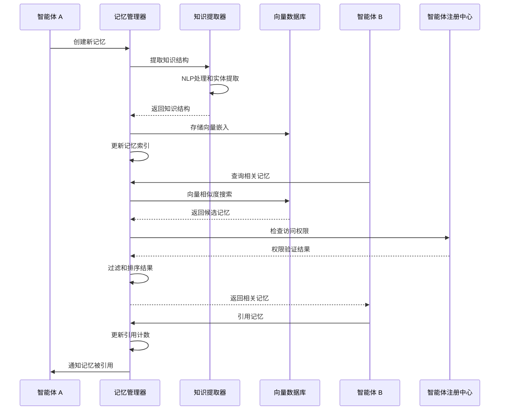
```mermaid
sequenceDiagram
    participant A1 as 智能体 A
    participant MM as 记忆管理器
    participant KE as 知识提取器
    participant VDB as 向量数据库
    participant A2 as 智能体 B
    participant AR as 智能体注册中心

    A1->>MM: 创建新记忆
    MM->>KE: 提取知识结构
    KE->>KE: NLP处理和实体提取
    KE-->>MM: 返回知识结构
    MM->>VDB: 存储向量嵌入
    MM->>MM: 更新记忆索引

    A2->>MM: 查询相关记忆
    MM->>VDB: 向量相似度搜索
    VDB-->>MM: 返回候选记忆
    MM->>AR: 检查访问权限
    AR-->>MM: 权限验证结果
    MM->>MM: 过滤和排序结果
    MM-->>A2: 返回相关记忆

    A2->>MM: 引用记忆
    MM->>MM: 更新引用计数
    MM->>A1: 通知记忆被引用
```

## 🔌 服务间通信

### 1. 同步通信模式

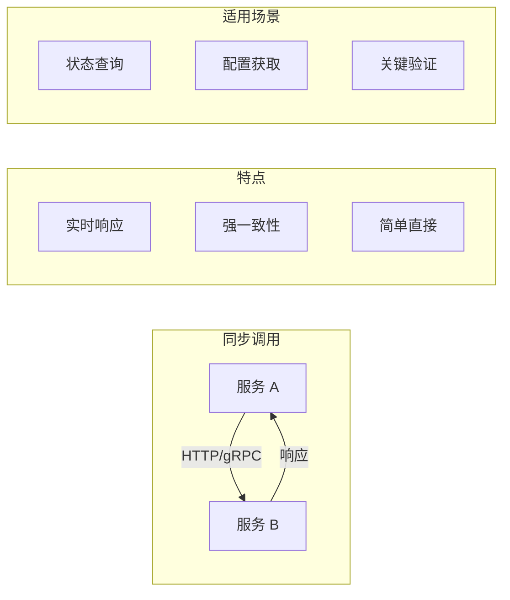
```mermaid
graph LR
    subgraph "同步调用"
        A[服务 A] -->|HTTP/gRPC| B[服务 B]
        B -->|响应| A
    end

    subgraph "特点"
        C[实时响应]
        D[强一致性]
        E[简单直接]
    end

    subgraph "适用场景"
        F[状态查询]
        G[配置获取]
        H[关键验证]
    end
```

**适用于**:

- 智能体状态查询
- 权限验证
- 配置获取
- 实时计算结果

### 2. 异步通信模式

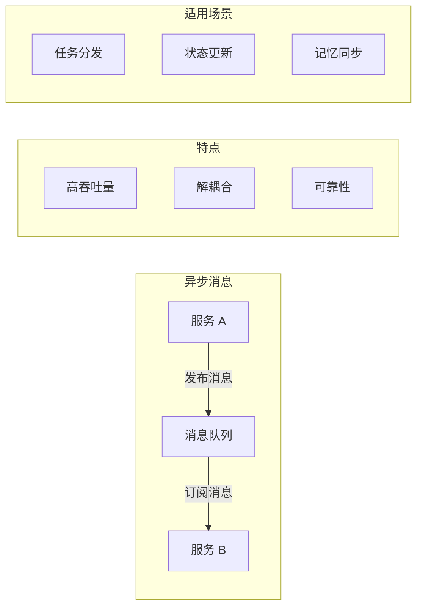
```mermaid
graph LR
    subgraph "异步消息"
        A[服务 A] -->|发布消息| MQ[消息队列]
        MQ -->|订阅消息| B[服务 B]
    end

    subgraph "特点"
        C[高吞吐量]
        D[解耦合]
        E[可靠性]
    end

    subgraph "适用场景"
        F[任务分发]
        G[状态更新]
        H[记忆同步]
    end
```

**适用于**:

- 任务分配和执行
- 状态变更通知
- 记忆更新和同步
- 事件驱动处理

### 3. 流式通信模式

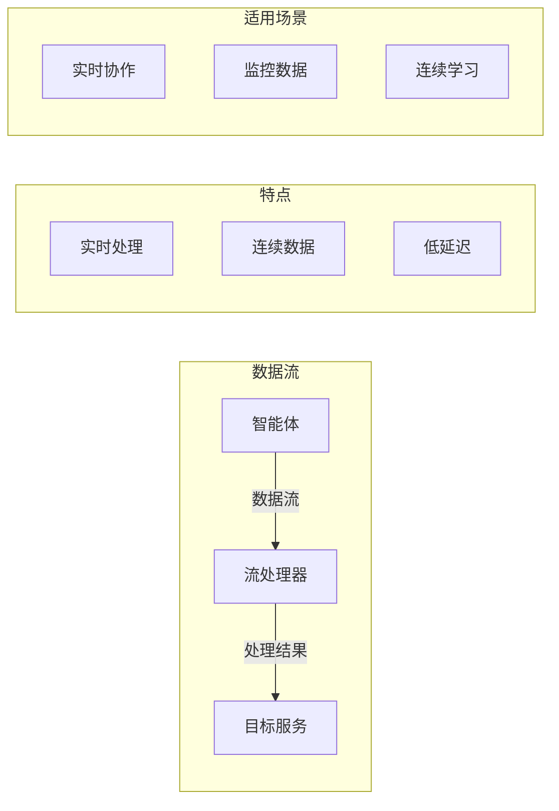
```mermaid
graph LR
    subgraph "数据流"
        A[智能体] -->|数据流| S[流处理器]
        S -->|处理结果| B[目标服务]
    end

    subgraph "特点"
        C[实时处理]
        D[连续数据]
        E[低延迟]
    end

    subgraph "适用场景"
        F[实时协作]
        G[监控数据]
        H[连续学习]
    end
```

**适用于**:

- 实时协作会话
- 性能监控数据
- 连续学习过程
- 大规模数据处理

## 🛡️ 安全架构

### 1. 多层安全防护

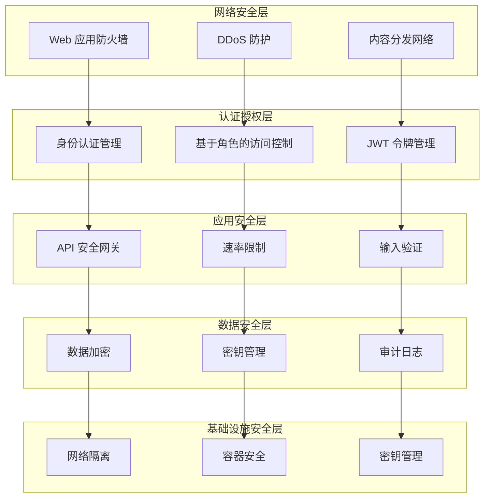
```mermaid
graph TB
    subgraph "网络安全层"
        WAF[Web 应用防火墙]
        DDoS[DDoS 防护]
        CDN[内容分发网络]
    end

    subgraph "认证授权层"
        IAM[身份认证管理]
        RBAC[基于角色的访问控制]
        JWT[JWT 令牌管理]
    end

    subgraph "应用安全层"
        API_SEC[API 安全网关]
        RATE_LIMIT[速率限制]
        INPUT_VAL[输入验证]
    end

    subgraph "数据安全层"
        ENCRYPT[数据加密]
        KEY_MGMT[密钥管理]
        AUDIT[审计日志]
    end

    subgraph "基础设施安全层"
        NETWORK_SEG[网络隔离]
        CONTAINER_SEC[容器安全]
        SECRET_MGMT[密钥管理]
    end

    WAF --> IAM
    DDoS --> RBAC
    CDN --> JWT

    IAM --> API_SEC
    RBAC --> RATE_LIMIT
    JWT --> INPUT_VAL

    API_SEC --> ENCRYPT
    RATE_LIMIT --> KEY_MGMT
    INPUT_VAL --> AUDIT

    ENCRYPT --> NETWORK_SEG
    KEY_MGMT --> CONTAINER_SEC
    AUDIT --> SECRET_MGMT
```

### 2. 端到端加密架构

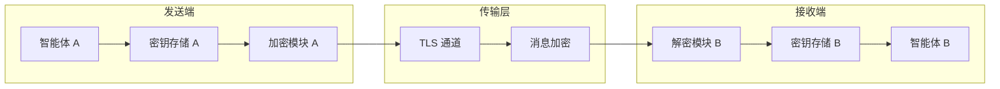
```mermaid
graph LR
    subgraph "发送端"
        A[智能体 A]
        KS_A[密钥存储 A]
        E_A[加密模块 A]
    end

    subgraph "传输层"
        TLS[TLS 通道]
        MSG_ENC[消息加密]
    end

    subgraph "接收端"
        D_B[解密模块 B]
        KS_B[密钥存储 B]
        B[智能体 B]
    end

    A --> KS_A
    KS_A --> E_A
    E_A --> TLS
    TLS --> MSG_ENC
    MSG_ENC --> D_B
    D_B --> KS_B
    KS_B --> B
```

## 🚀 部署架构

### 1. 容器化部署

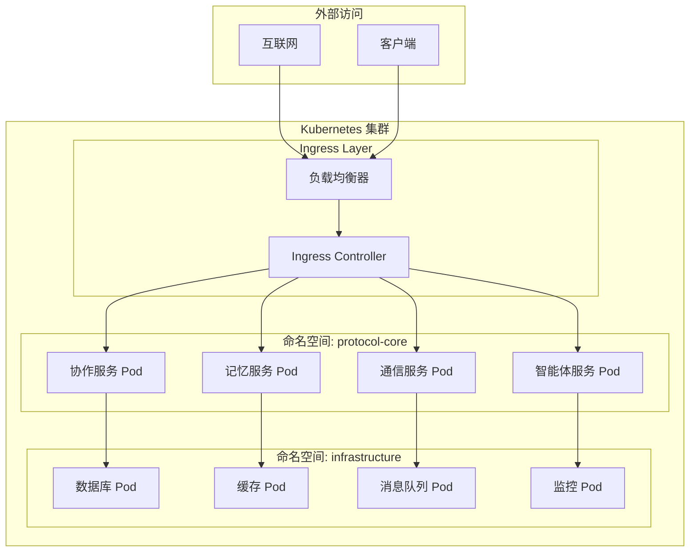
```mermaid
graph TB
    subgraph "Kubernetes 集群"
        subgraph "命名空间: protocol-core"
            COLLAB_POD[协作服务 Pod]
            COMM_POD[通信服务 Pod]
            MEMORY_POD[记忆服务 Pod]
            AGENT_POD[智能体服务 Pod]
        end

        subgraph "命名空间: infrastructure"
            DB_POD[数据库 Pod]
            CACHE_POD[缓存 Pod]
            MQ_POD[消息队列 Pod]
            MONITOR_POD[监控 Pod]
        end

        subgraph "Ingress Layer"
            INGRESS[Ingress Controller]
            LB[负载均衡器]
        end
    end

    subgraph "外部访问"
        INTERNET[互联网]
        CLIENTS[客户端]
    end

    INTERNET --> LB
    CLIENTS --> LB
    LB --> INGRESS

    INGRESS --> COLLAB_POD
    INGRESS --> COMM_POD
    INGRESS --> MEMORY_POD
    INGRESS --> AGENT_POD

    COLLAB_POD --> DB_POD
    COMM_POD --> MQ_POD
    MEMORY_POD --> CACHE_POD
    AGENT_POD --> MONITOR_POD
```

### 2. 微服务拓扑

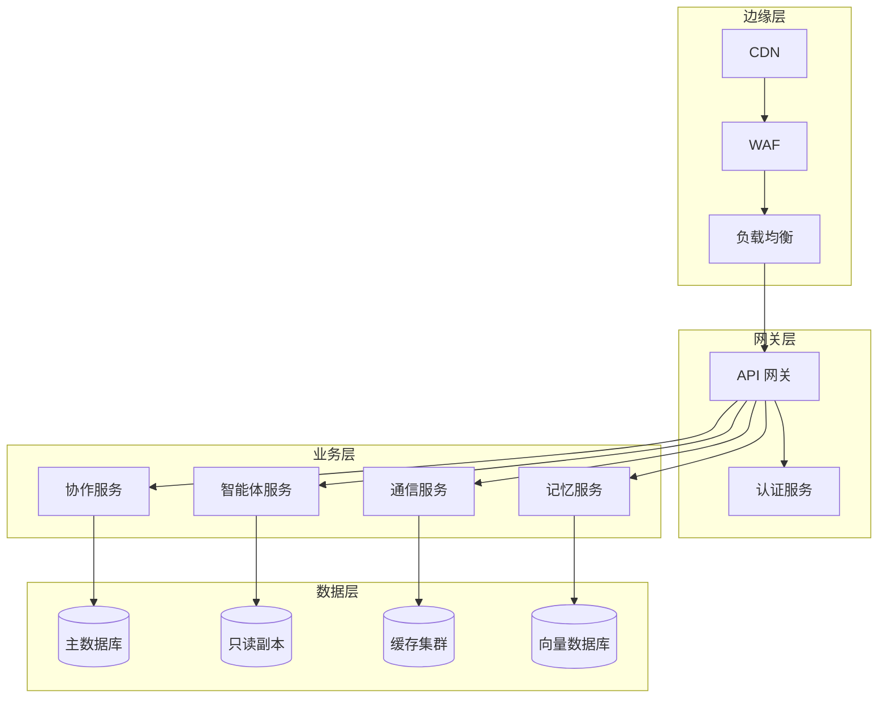
```mermaid
graph TB
    subgraph "边缘层"
        CDN[CDN]
        WAF[WAF]
        LB[负载均衡]
    end

    subgraph "网关层"
        API_GW[API 网关]
        AUTH_SVC[认证服务]
    end

    subgraph "业务层"
        COLLAB_SVC[协作服务]
        COMM_SVC[通信服务]
        AGENT_SVC[智能体服务]
        MEMORY_SVC[记忆服务]
    end

    subgraph "数据层"
        PRIMARY_DB[(主数据库)]
        REPLICA_DB[(只读副本)]
        CACHE_CLUSTER[(缓存集群)]
        VECTOR_DB[(向量数据库)]
    end

    CDN --> WAF
    WAF --> LB
    LB --> API_GW

    API_GW --> AUTH_SVC
    API_GW --> COLLAB_SVC
    API_GW --> COMM_SVC
    API_GW --> AGENT_SVC
    API_GW --> MEMORY_SVC

    COLLAB_SVC --> PRIMARY_DB
    COMM_SVC --> CACHE_CLUSTER
    AGENT_SVC --> REPLICA_DB
    MEMORY_SVC --> VECTOR_DB
```

## 📈 扩展性设计

### 1. 水平扩展策略

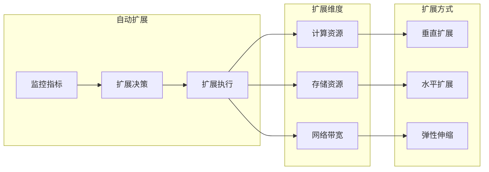
```mermaid
graph LR
    subgraph "自动扩展"
        MONITOR[监控指标]
        DECIDE[扩展决策]
        SCALE[扩展执行]
    end

    subgraph "扩展维度"
        COMPUTE[计算资源]
        STORAGE[存储资源]
        NETWORK[网络带宽]
    end

    subgraph "扩展方式"
        VERTICAL[垂直扩展]
        HORIZONTAL[水平扩展]
        ELASTIC[弹性伸缩]
    end

    MONITOR --> DECIDE
    DECIDE --> SCALE

    SCALE --> COMPUTE
    SCALE --> STORAGE
    SCALE --> NETWORK

    COMPUTE --> VERTICAL
    STORAGE --> HORIZONTAL
    NETWORK --> ELASTIC
```

### 2. 性能优化架构

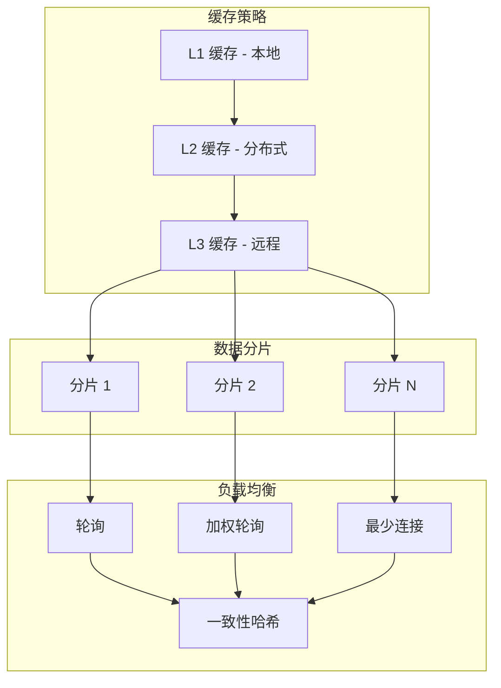
```mermaid
graph TB
    subgraph "缓存策略"
        L1[L1 缓存 - 本地]
        L2[L2 缓存 - 分布式]
        L3[L3 缓存 - 远程]
    end

    subgraph "数据分片"
        SHARD1[分片 1]
        SHARD2[分片 2]
        SHARDN[分片 N]
    end

    subgraph "负载均衡"
        RR[轮询]
        WRR[加权轮询]
        LC[最少连接]
        HASH[一致性哈希]
    end

    L1 --> L2
    L2 --> L3

    L3 --> SHARD1
    L3 --> SHARD2
    L3 --> SHARDN

    SHARD1 --> RR
    SHARD2 --> WRR
    SHARDN --> LC

    RR --> HASH
    WRR --> HASH
    LC --> HASH
```

## 🔍 监控和可观测性

### 1. 三支柱可观测性

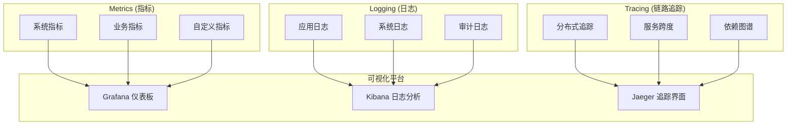
```mermaid
graph TB
    subgraph "Metrics (指标)"
        SYS_METRICS[系统指标]
        BIZ_METRICS[业务指标]
        CUSTOM_METRICS[自定义指标]
    end

    subgraph "Logging (日志)"
        APP_LOGS[应用日志]
        SYS_LOGS[系统日志]
        AUDIT_LOGS[审计日志]
    end

    subgraph "Tracing (链路追踪)"
        DIST_TRACE[分布式追踪]
        SPAN_TRACE[服务跨度]
        DEP_MAP[依赖图谱]
    end

    subgraph "可视化平台"
        GRAFANA[Grafana 仪表板]
        KIBANA[Kibana 日志分析]
        JAEGER_UI[Jaeger 追踪界面]
    end

    SYS_METRICS --> GRAFANA
    BIZ_METRICS --> GRAFANA
    CUSTOM_METRICS --> GRAFANA

    APP_LOGS --> KIBANA
    SYS_LOGS --> KIBANA
    AUDIT_LOGS --> KIBANA

    DIST_TRACE --> JAEGER_UI
    SPAN_TRACE --> JAEGER_UI
    DEP_MAP --> JAEGER_UI
```

### 2. 告警和响应架构

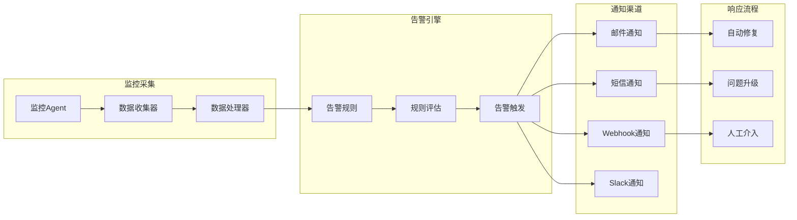
```mermaid
graph LR
    subgraph "监控采集"
        AGENT[监控Agent]
        COLLECTOR[数据收集器]
        PROCESSOR[数据处理器]
    end

    subgraph "告警引擎"
        RULES[告警规则]
        EVAL[规则评估]
        TRIGGER[告警触发]
    end

    subgraph "通知渠道"
        EMAIL[邮件通知]
        SMS[短信通知]
        WEBHOOK[Webhook通知]
        SLACK[Slack通知]
    end

    subgraph "响应流程"
        AUTO_HEAL[自动修复]
        ESCALATE[问题升级]
        MANUAL[人工介入]
    end

    AGENT --> COLLECTOR
    COLLECTOR --> PROCESSOR
    PROCESSOR --> RULES

    RULES --> EVAL
    EVAL --> TRIGGER

    TRIGGER --> EMAIL
    TRIGGER --> SMS
    TRIGGER --> WEBHOOK
    TRIGGER --> SLACK

    EMAIL --> AUTO_HEAL
    SMS --> ESCALATE
    WEBHOOK --> MANUAL
```

## 🎮 控制平面架构

### 1. 配置管理

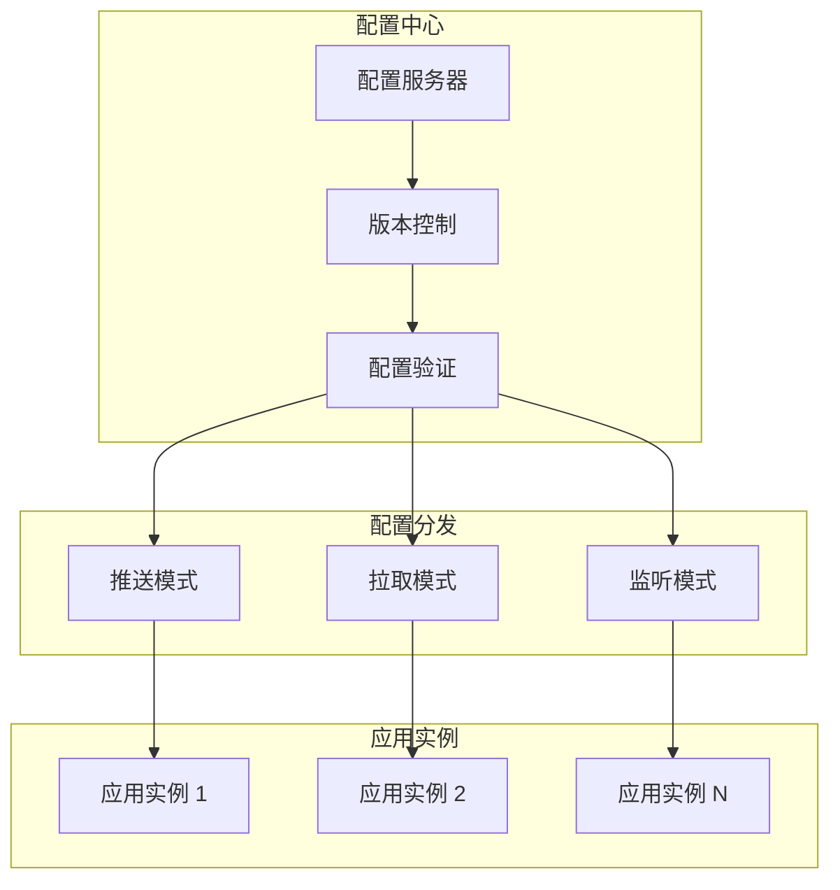
```mermaid
graph TB
    subgraph "配置中心"
        CONFIG_SERVER[配置服务器]
        VERSION_CTRL[版本控制]
        VALIDATION[配置验证]
    end

    subgraph "配置分发"
        PUSH[推送模式]
        PULL[拉取模式]
        WATCH[监听模式]
    end

    subgraph "应用实例"
        APP1[应用实例 1]
        APP2[应用实例 2]
        APPN[应用实例 N]
    end

    CONFIG_SERVER --> VERSION_CTRL
    VERSION_CTRL --> VALIDATION

    VALIDATION --> PUSH
    VALIDATION --> PULL
    VALIDATION --> WATCH

    PUSH --> APP1
    PULL --> APP2
    WATCH --> APPN
```

### 2. 服务发现

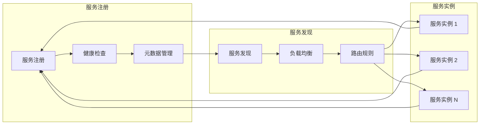
```mermaid
graph LR
    subgraph "服务注册"
        REG[服务注册]
        HEALTH[健康检查]
        META[元数据管理]
    end

    subgraph "服务发现"
        DISC[服务发现]
        LB[负载均衡]
        ROUTE[路由规则]
    end

    subgraph "服务实例"
        SVC1[服务实例 1]
        SVC2[服务实例 2]
        SVCN[服务实例 N]
    end

    SVC1 --> REG
    SVC2 --> REG
    SVCN --> REG

    REG --> HEALTH
    HEALTH --> META

    META --> DISC
    DISC --> LB
    LB --> ROUTE

    ROUTE --> SVC1
    ROUTE --> SVC2
    ROUTE --> SVCN
```

---

这个架构设计为多智能体协作协议提供了完整的技术架构蓝图，涵盖了从核心服务到基础设施的各个层面，确保系统的可扩展性、可靠性和高性能。架构采用云原生设计理念，支持现代化的部署和运维方式。
